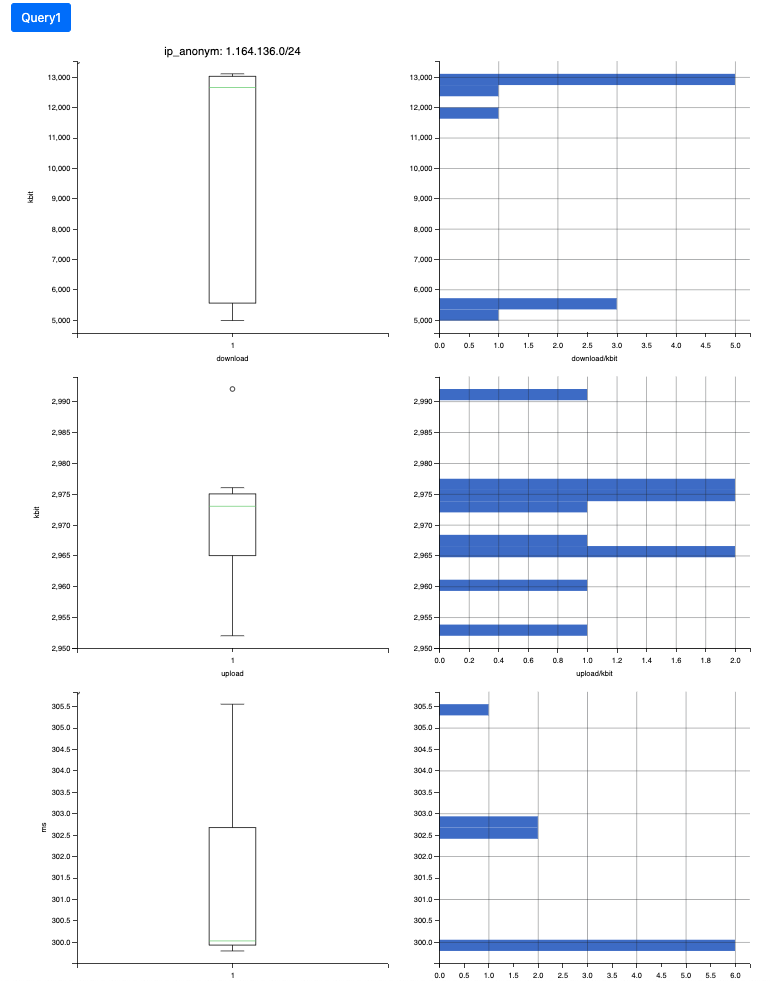
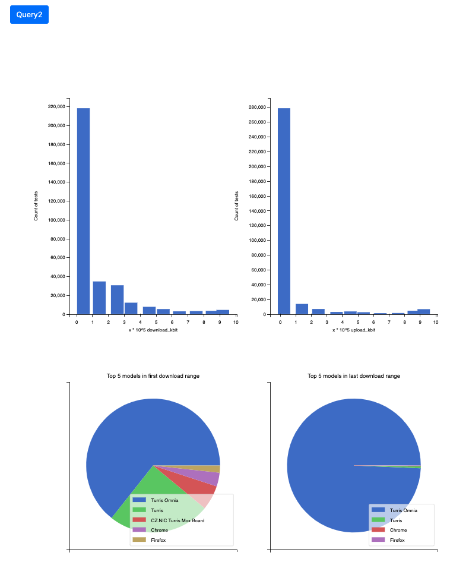
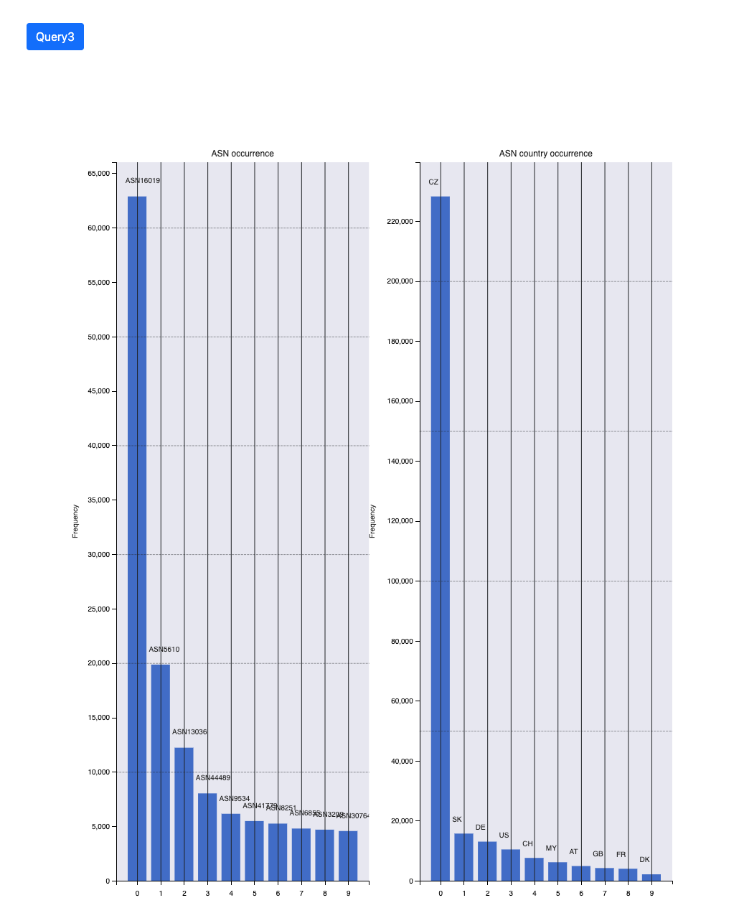

# UPA - Projekt


## Zadanie
5. Rychlost internetového připojení


## Zvolené dotazy
A   -   vytvorte popisné charakteristiky pro měřené hodnoty download, upload a ping pro
zvoleného uživatele či síť (IP prefix); využijte krabicové grafy, histogramy, atd.

B   - seskupte uživatele podle rychlosti jejich připojení (v intervalech) a určete společné a
rozdílné vlastnosti jednotlivých skupin

C   -   zoskupte užívateľov podľa ASN a vyhodnoťte najčastejšie ASNs vyskytujúce sa v dat
a setoch a zároveň najčastejšie krajiny, v ktorých sú jednotlivé ASNs zaregistrované


## Spustenie projektu

#### Požiadavky pred spustením
- `Docker`
- `docker-compose`

Nasledujúce príkazy je potrebné spúšťať v koreňovom adresári projektu.


- Ako prvé treba spustiť Docker kontajner, v ktorom bežia databázy, webový server a
aplikácia. 
```shell 
docker-compose up
```

- Po spustení databáz a webového servera je možné nahrať všetky dáta do databázy. Pre
spustenie jednotlivých krokov samostatne, je možné využiť aplikáciu `runner.py`

#### Spúšťacia aplikácia

- Stiahnuť dáta z určitého časového rozmedzia

```shell
docker-compose exec app python runner.py download_data_in_range [--start-month INT --start-year INT --end-month INT --end-year INT]
```

- Načítať stiahnuté dáta do Mongo databázy a dáta zo špecifikovaného časového rozmedzia do  Postgre databázy

```shell
docker-compose exec app python runner.py init_both_databases [--start-month INT --start-year INT --end-month INT --end-year INT]
```

- Zobrazenie všetkých možností

```shell
docker-compose exec app python runner.py --help
```


## Popis implementácie

Dáta sú získavané z NetMeter. Tie sú následne spracované a upravené pre naše konkrétne
požiadavky. Vo forme CSV následné nahrané ako Pandas dataframes a na nich je vykonávané
čistenie. V tomto kontexte, máme obrovské množstvo platných dát takže nemám zmysel dopĺňať
hodnoty ako download, upload a ping a preto dáta, ktoré neobsahujú tento atribút
zahadzujeme.  


Pre NoSQL databázu bola zvolená technológia MongoDB a pre relačnú databázu bolo zvolené
PostgreSQL. V MongoDB sú uložené len tie dáta, ktoré sú využívane pri dotazoch. To je
`open_uuid`, `open_test_uuid`, `download_kbit`, `upload_kbit`, `ping_ms`, `asn`,
`ip_anonym, speed_test_duration_ms`, `network_type`, `model`. _network\_type_ a _model_ sú
používané pre dotaz B pretože pri spoznávaní datasetu sme zistili, že majú najvyššiu
početnosť a teda ich obsahujú takmer všetky dáta a dostatočne hovoria o nejakej vlastnosti
daného testu. Model vyjadruje reťazec zariadenia na ktorom bol test vykonaný a
_network\_type_ zase predstavuje typ siete ako WLAN, LAN, ktorá bola použitá na test.
_open\_test\_uuid_ by malo podľa netmetru mať formát UUID a teda jeho unikátnosť patrične
využívame v relačnej databáze ako primárny kľúč. 

Pri prevode dát z MongoDB do PostgreSQL sú vybraté len potrebné údaje a ku nim získaný
kód krajiny pre ich konkrétne ASN. Kód krajiny sa získava z RIPE API a je priradený do
tabuľky pre ASN, ktorá je priradená ku každej tabuľke testovania s rovnakou ASN. Dáta
z MongoDB sú získána na základe časového obdobia, poskytnutého užívateľom.


Pri získavaní dát z RIPE API bol zistený problém s rýchlosťou získavania kódu krajiny pre
každé jedno dato. Jeden dotaz trval viac ako 1 sekundu, čo je neprijateľné pre naše
množstvo dát, kvôli tomu bolo získavanie implementované pomocou asynchrónnych funkcií.


Dáta pre dotazy sú vybrané z PostgreSQL databázy priamo v nej a v python aplikácii vizualizované
pomocou `matplotlib` knižnice do grafov. Grafy sú transformované do html podoby cez
knižnicu `mpld3` a zobrazené na vlastne API na `localhost:8000`. 

Pri poslednom kroku dotazov, transformácie grafov do html sa objavil problém s knižnicou
`mpld3`, ktorá nepodporuje všetky funkcionality `matplotlib` čo skomplikovalo upravovanie
vzhľadu grafov.


## Popis získaných výsledkov

### Dotaz A


Pri tomto dotaze boli vytvorené popisné charakteristiky pre každého užívateľa s hodnotami
`download`, `upload` a `ping`.

### Dotaz B


Dotazom B sa zistilo, že veľká časť užívateľov patrí do jedného rozmedzia rýchlosti
sťahovania a nahrávania. Väčšina užívateľov nemá rýchlejšie pripojenie ako 999999 kbit.

Najčastejšie použité zariadenie na meranie rýchlosti je Turis Omnia, tieto zariadenia
patria pod CZ.NIC a pravdepodobne majú testovanie rýchlosti pripojenia na NetMeter nastavené ako
predvolené. 

### Dotaz C


Dotaz C ukázal podobný vysoký rozdiel jednej hodnoty ako predošlý dotaz. Česko ako krajina, pod
ktorou je zaregistrované ASN, bola až 11-krát častejšia ako druhá krajina v poradí,
Slovensko.

Pri konkrétnych ASN prevláda Vodafone CZ a nasleduje ho s 3-násobne menším počtom O2 CZ.
